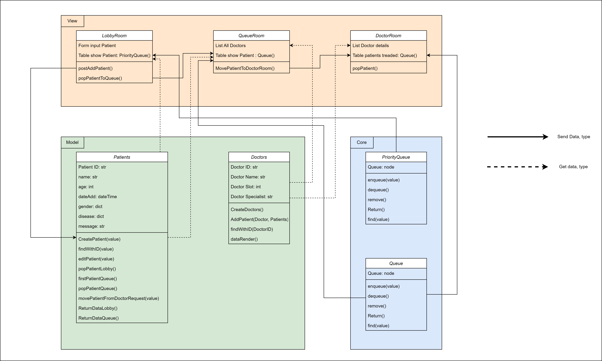
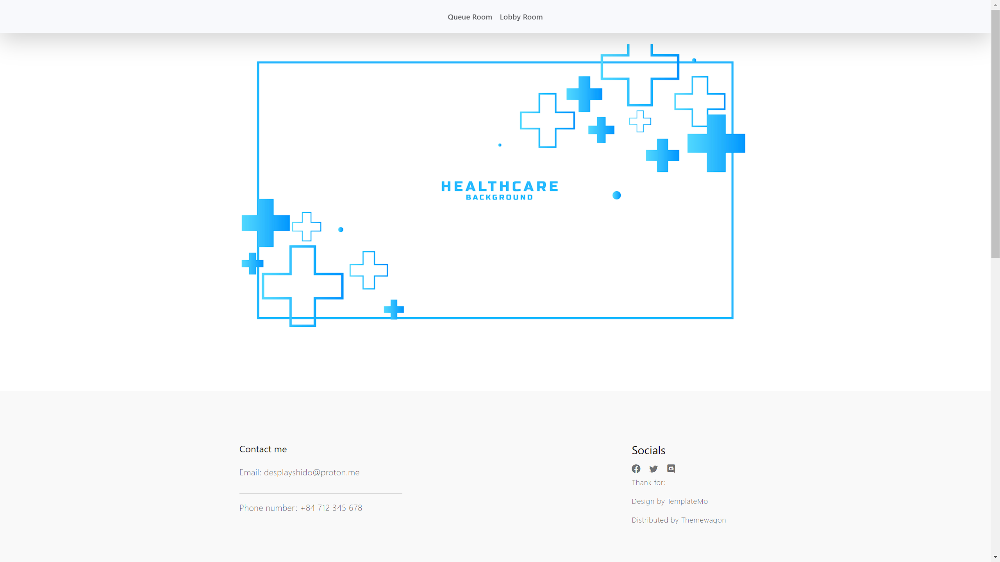
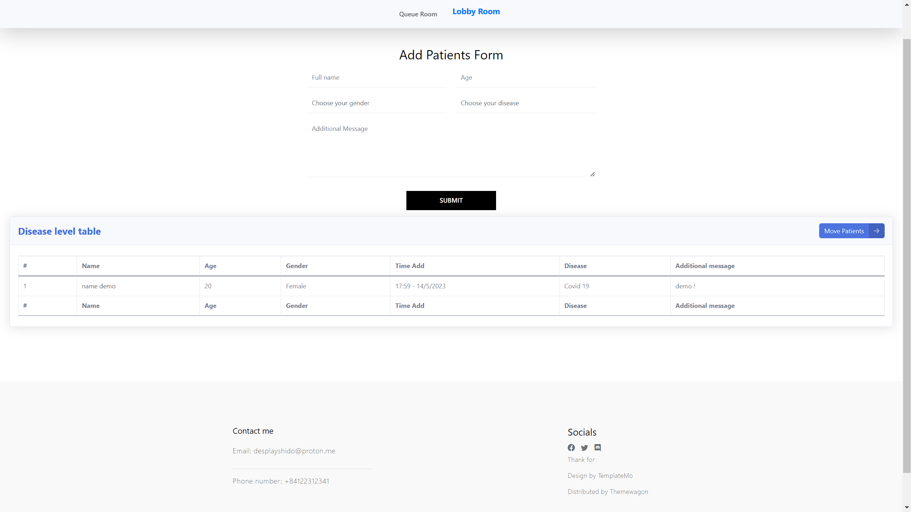

<div align="center">

# Heart Care Project
*Author by DeplayShido, OliverZeros and Reus*
</div>

Little project open source for learn backend development using with Django

This project uses without any SQL, is using manual database

## License
This project created by Desplay, Oliver and Reus

## First time ?
Run file `install-framework.bat` for first, and run `run-server.bat` for run server, All this file in folder `./Utils`

## Class diagram


## Some Preview

### Menu


### Lobby


## Using


## requirements
```
python                  3.11.3
Django                  4.2.1  
daphne                  4.0.0
channels                4.0.0
```

## Contributors
[](https://github.com/Desplay/heart-care-project/graphs/contributors)
